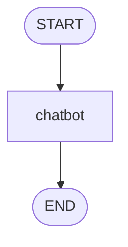

# Agentic Chatbot

Project ini adalah chatbot sederhana berbasis LangGraph dan Streamlit.
User mengirim pesan, lalu pesan diproses oleh node `chatbot` untuk menghasilkan jawaban dari model LLM.

## Workflow Graph

Alur di bawah menunjukkan proses inti yang saat ini masih sederhana: dari `START` ke `chatbot`, lalu ke `END`.

