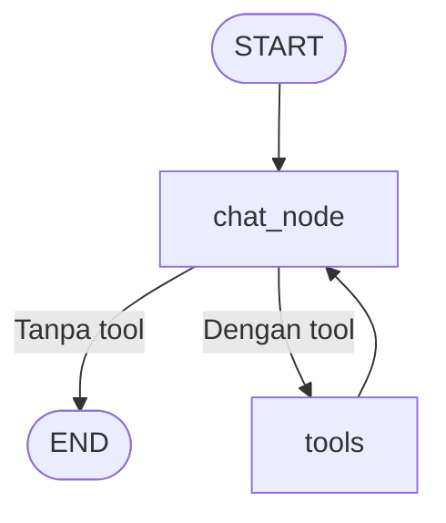
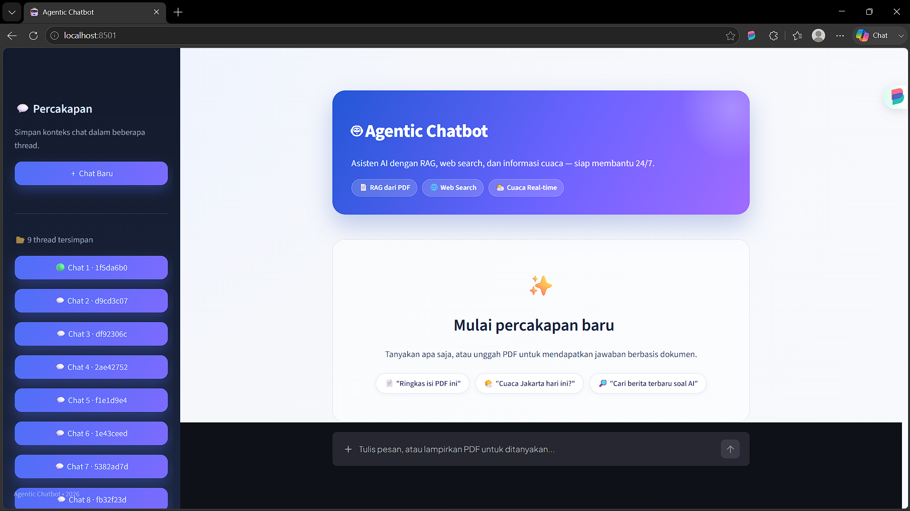
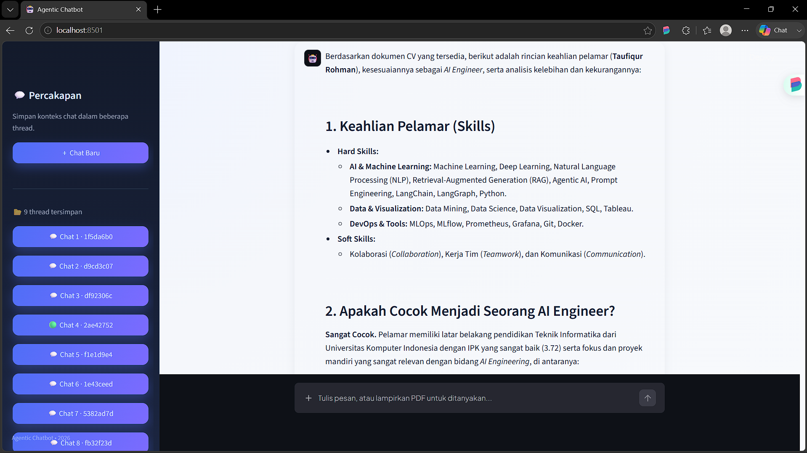
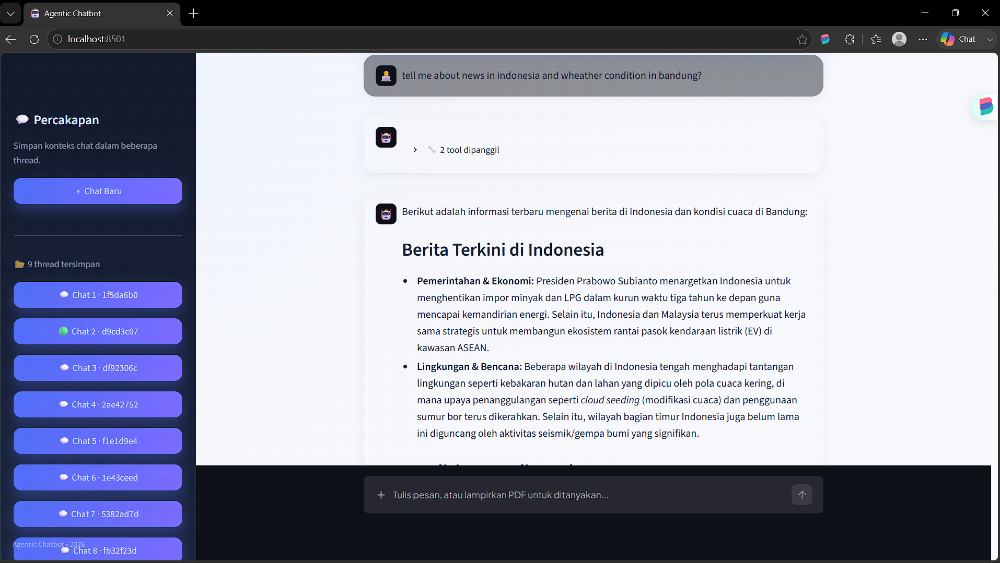

# Agentic Chatbot

Chatbot berbasis **LangGraph**, **LangChain**, **Google Gemini**, dan
**Streamlit**. Agent dapat menjawab langsung atau memilih tool yang sesuai.

## Fitur

- RAG untuk menjawab pertanyaan berdasarkan PDF.
- Web search dengan Tavily.
- Informasi cuaca dengan Weatherstack.
- Streaming jawaban dan riwayat percakapan.
- Memory multi-thread menggunakan SQLite checkpoint.

## RAG

Alur RAG:

1. PDF diunggah dan dibaca dengan `PyPDFLoader`.
2. Teks dipecah menggunakan `RecursiveCharacterTextSplitter`.
3. Teks diubah menjadi embedding dengan `GoogleGenerativeAIEmbeddings`.
4. Embedding disimpan di vector store **FAISS** (`faiss_db/`).
5. `rag_tool` mengambil empat potongan paling relevan sebagai konteks jawaban.

RAG digunakan untuk pertanyaan yang berkaitan dengan isi PDF. Index FAISS
dibuat ulang setiap kali PDF baru diunggah.

## Tools

| Tool          | Fungsi                                               |
| ------------- | ---------------------------------------------------- |
| `rag_tool`    | Mencari informasi dari PDF yang diunggah             |
| `search_tool` | Mencari informasi terbaru di internet melalui Tavily |
| `get_weather` | Mengambil cuaca terkini melalui Weatherstack         |

## Workflow

LLM menentukan apakah pertanyaan membutuhkan tool. Setelah tool selesai,
hasilnya dikirim kembali ke LLM untuk membuat jawaban final.

## File Utama

- `app_rag-yt.py`: aplikasi Streamlit dengan upload PDF dan RAG.
- `agentic_chatbot_rag_backend.py`: backend LLM, RAG, tools, graph, dan
  checkpoint.
- `app_tool.py`: demo agent dengan Tavily dan Weatherstack.
- `app_thread.py`: demo percakapan multi-thread.
- `app_streaming.py`: demo streaming response.

