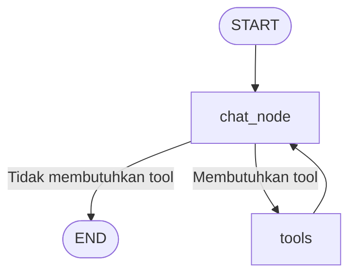

# Agentic Chatbot

Chatbot agentic berbasis **LangGraph**, **LangChain**, **Google Gemini**, dan
**Streamlit**. Model tidak hanya menjawab pertanyaan secara langsung, tetapi
memilih tool yang sesuai berdasarkan kebutuhan pertanyaan.

## Fitur Utama

- **Agent workflow berbasis LangGraph**: state percakapan dikelola dalam graph
  yang terdiri dari node model dan node tools.
- **RAG (Retrieval-Augmented Generation)** untuk menjawab pertanyaan dari
  dokumen PDF yang diunggah.
- **Web search** menggunakan Tavily untuk informasi terkini atau informasi yang
  membutuhkan pencarian internet.
- **Informasi cuaca** menggunakan Weatherstack API.
- **Streaming response**: jawaban ditampilkan bertahap saat model menghasilkan
  token.
- **Memory dan multi-thread conversation**: setiap percakapan memiliki
  `thread_id` dan disimpan menggunakan SQLite checkpoint.
- **Antarmuka Streamlit** dengan riwayat percakapan, tombol `New Chat`, dan
  indikator tool yang sedang digunakan.

## Tools yang Digunakan Agent

### 1. `rag_tool`

Digunakan ketika pertanyaan berkaitan dengan PDF atau dokumen yang telah
diunggah. Tool ini mengambil potongan dokumen yang paling relevan dari vector
store FAISS, lalu mengembalikan konten beserta sumber dan halaman dokumen.

Komponen RAG:

1. PDF dibaca menggunakan `PyPDFLoader`.
2. Teks dipecah menjadi potongan berukuran 1.000 karakter dengan overlap 200
   karakter menggunakan `RecursiveCharacterTextSplitter`.
3. Setiap potongan diubah menjadi embedding menggunakan
   `GoogleGenerativeAIEmbeddings` (`gemini-embedding-001`).
4. Embedding disimpan ke vector store lokal **FAISS** di folder `faiss_db`.
5. Saat user bertanya, retriever melakukan similarity search dan mengambil
   empat potongan paling relevan (`k=4`).
6. LLM menggunakan hasil retrieval sebagai konteks jawaban.

Dengan pendekatan ini, jawaban terkait PDF didasarkan pada isi dokumen, bukan
semata-mata pengetahuan bawaan model. Setiap unggahan PDF membuat ulang index
FAISS yang aktif.

### 2. `search_tool`

Menggunakan **Tavily Search** untuk mencari informasi umum di internet,
terutama berita, kejadian terbaru, atau pertanyaan yang memerlukan data
real-time. Konfigurasi saat ini menggunakan maksimal lima hasil dengan
`search_depth="advanced"`.

### 3. `get_weather`

Mengambil cuaca terkini sebuah kota melalui **Weatherstack API**, termasuk
deskripsi cuaca, suhu, dan kelembapan.

## Alur Workflow

Pada varian agent dengan tools, alurnya adalah:



`chat_node` meneruskan percakapan ke LLM yang sudah di-bind dengan daftar
tools. `tools_condition` menentukan apakah hasil LLM langsung selesai atau
diteruskan ke `ToolNode`. Setelah tool selesai, hasilnya dikirim kembali ke
LLM untuk menghasilkan jawaban final.

## Struktur File Penting

| File                              | Keterangan                                                                                      |
| --------------------------------- | ----------------------------------------------------------------------------------------------- |
| `app_rag-yt.py`                   | Aplikasi Streamlit utama dengan upload PDF, RAG, tools, streaming, dan riwayat thread           |
| `agentic_chatbot_rag_backend.py`  | Konfigurasi LLM, embedding, ingestion PDF, retriever FAISS, tools, graph, dan SQLite checkpoint |
| `app_tool.py`                     | Demo antarmuka untuk agent dengan search dan weather tool                                       |
| `agentic_chatbot_tool_backend.py` | Backend agent dengan Tavily, Weatherstack, dan tool routing                                     |
| `app_thread.py`                   | Demo multi-thread conversation dengan checkpoint                                                |
| `app_streaming.py`                | Demo streaming response                                                                         |
| `agentic_chatbot_backend.py`      | Agent dasar menggunakan model Ollama lokal dan graph sederhana                                  |
| `faiss_db/`                       | Index vector FAISS hasil proses ingestion PDF                                                   |
| `chatbot.db`                      | Database checkpoint untuk percakapan agent RAG                                                  |

## Instalasi dan Konfigurasi

Proyek membutuhkan Python `>=3.12`. Dengan `uv`:

```bash
uv sync
```

Buat file `.env` pada root proyek dan isi credential yang diperlukan:

```env
GOOGLE_API_KEY=your_google_api_key
TAVILY_API_KEY=your_tavily_api_key
WEATHERSTACK_API_KEY=your_weatherstack_api_key
```

## Menjalankan Aplikasi

Jalankan aplikasi utama:

```bash
uv run streamlit run app_rag-yt.py
```

Setelah aplikasi terbuka:

1. Unggah PDF melalui tombol lampiran pada input chat.
2. Tunggu sampai PDF selesai diproses dan index FAISS dibuat.
3. Ajukan pertanyaan yang berkaitan dengan isi PDF untuk menggunakan RAG.
4. Ajukan pertanyaan tentang cuaca atau informasi terkini untuk menguji tool
   Weatherstack dan Tavily.

Demo lain dapat dijalankan dengan perintah berikut:

```bash
uv run streamlit run app_tool.py
uv run streamlit run app_thread.py
uv run streamlit run app_streaming.py
```

## Screenshot


